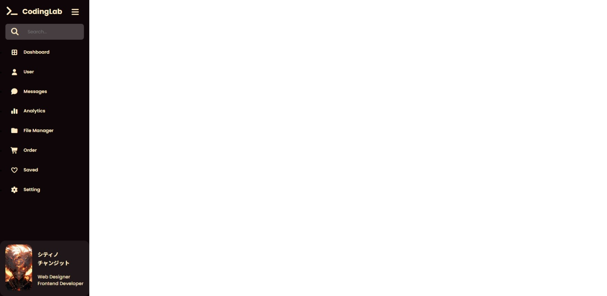

# 🟤 Gold & Brown Sidebar

A **modern sidebar navigation UI** built with **HTML, CSS, and Vanilla JavaScript**.
Designed with a **gold–brown theme**, glowing hover effects, tooltips on collapsed state, and smooth transitions for user interaction.

🔗 <span><strong>Live Demo:</strong> </span><a href="https://nsnet21.github.io/06-gold-and-brown-sidebar/" target="_blank"><b>Open Project Demo</b></a>

---

## 🖼️ Preview



---

## 🚀 Features

- ⚙️ **Collapsible Sidebar** — toggle between expanded and collapsed states.
- 💡 **Dynamic Tooltips** — appear automatically when the sidebar is collapsed.
- 🎨 **Gold–Brown Theme** — elegant color palette using CSS variables.
- 🧭 **Search Box Animation** — interactive search icon with tooltip logic.
- 👤 **Profile Card Section** — includes animated hover effects on avatar and name.
- ⚡ **Pure JavaScript Implementation** — no libraries required.

---

## 🧠 How It Works

- JavaScript toggles the sidebar collapse state:
  ```js
  toggleMenu.addEventListener("click", () => {
    sideBar.classList.toggle("collapsed");
  });
  ```
- When the sidebar is collapsed:

  - Text labels fade out
  - Tooltips appear next to icons
  - Profile section shrinks and image fades

- Tooltip visibility logic:

  ```js
  stIcon.addEventListener("mouseenter", () => {
    if (sideBar.classList.contains("collapsed")) {
      stTooltip.style.opacity = "1";
    }
  });
  stIcon.addEventListener("mouseleave", () => {
    stTooltip.style.opacity = "";
  });
  ```

## 🧾 File Structure

```
  06Gold-and-Brown-Sidebar/
  │
  ├── assets-preview/
  │   └── preview.jpeg
  │
  ├── images/
  │   └── flare of light boy.jpg
  │
  ├── index.html
  ├── style.css
  ├── script.js
  └── README.md
```

## 🧩 Tech Stack

- **HTML5** — semantic layout structure
- **CSS3** — transitions, box shadows, hover glow, color variables
- **JavaScript (ES6)** — toggle logic and tooltip interactivity
- **Google Fonts:** [**Poppins**](https://fonts.google.com/specimen/Poppins?query=poppins)
  & [**Noto Serif JP**](https://fonts.google.com/noto/specimen/Noto+Serif+JP)
- **Font Awesome 7** — icons for navigation and profile section

## 🎨 Visual Highlights

- Warm amber glow when hovered
- Smooth collapsing animation for all sections
- Subtle tooltip fade-in/out transitions when being in collapse state
- Responsive hover reactions for logo, text, and profile

## 🌗 Color Palette

| Variable       | Color Code | Description        |
| -------------- | ---------- | ------------------ |
| `--background` | `#0f060a`  | Dark brown base    |
| `--text`       | `#feeac3`  | Cream gold text    |
| `--primary`    | `#f29b21`  | Gold accent        |
| `--secondary`  | `#463a3f`  | Shadow brown       |
| `--accent`     | `#ff822e`  | Bright orange glow |

---

**Created** by [**Nate**](https://github.com/nsnet21)
🌙
“Learning through building — one component at a time.”
